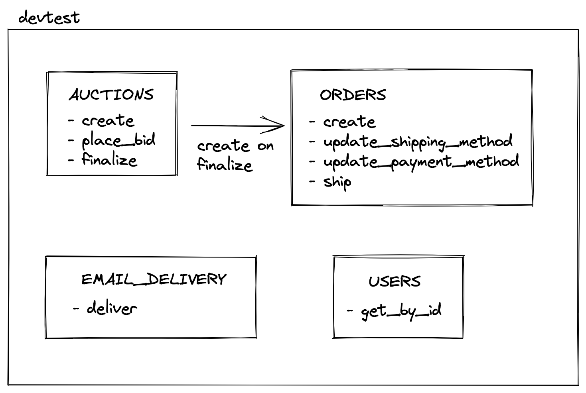

# GAT DevTest

## Installation and usage

This scaffold was created using Ruby 3.0. It is not a fully working application and was designed as a collection of modules
that can be injected into other applications.

### Dependencies

To install dependencies:

```
bundle install
```

### Database

To initialize the database:

```
rake db:create
rake db:migrate
rake db:migrate APP_ENV=test
```

To load the seeds:

```
ruby bin/seed.rb
```

To remove the databases for the scaffold:

```
rake db:drop
```

### Console

To explore the modules available here you can use

```
bin/console
```

### Specs

To run specs run:

```
rspec
```

### Background jobs

To run background jobs (using sidekiq and Redis):

```
bin/sidekiq
```

## Context

This test is not about solving a problem. It's about execution and checking what's your default way of thinking and coding/collaboration habits.
If you want to install any gems that can help you with solving the task, you are free to do so.

## General instructions

1. Fork this repository
2. All your changes should be made in a private fork of this repository.
3. All your changes should be made on a branch that is separate from `main` (create a new branch in your fork)
4. When you're done, please, please:

- Create a Pull Request in your repository from the branch with changes to **your** `main` branch
- Invite `@gat-developer` user as a repository collaborator (on the repository page: Settings -> Manage access -> Invite teams or people) with `Read` role, so that our reviewers can check out the code using Git.

## Description

The code in this repository is a small extract from an auction site that allows users to create auctions, bid on them, and in the end redeem won items. Code is independent of the delivery mechanisms like HTTP and only operates as a set of ruby modules that could be plugged in into different frameworks.

This repository provides database schema that can be loaded using rake task as well as some seed data to populate the database.

### Structure

This is the initial structure of this repository:



As you can see, modules support following actions:

- Create an auction
- Place a bid for an auction
- Finalize the auction
- Choose shipping method
- Choose payment method
- Ship the order

Modules communicate with each other only via their public APIs (classes from `Api` modules).
Any other classes are private.

### Instructions

Your task within the test is to implement the code that will fulfil these acceptance criteria:

1. When the auction is finished, the system should send email notification using external service to the auction participants - the winner and bidders:
   1. The actual call to external email service is simulated with the `sleep(5)` call in the `EmailDelivery` module (there is **no need** to call any external email service nor send via SMTP),
   2. There is no need to build an HTML template or email content, you can assume that it's done on the vendor's service (it only needs template variables),
   3. The auction winner should receive data about the order that was created (its `reference_number` and `total_payment`),
   4. Other participants should receive information about the highest bid.
2. When selecting the shipping method, a total order price should be calculated with added shipping cost:
   1. When shipping method `Fedyx Overnight` is selected, then the shipping price should be equal to weight rounded up to 1kg times `$2`,
   2. When shipping method `UPZ Express` is selected, when the shipping price should be equal to package volume (in m3) times a length of a joke fetched from https://api.chucknorris.io/.
3. Extend `Users` module so that it would allow a user to add a shipping address to their data. Shipping address should contain city, zip code and street address, all required strings. User can have only one shipping address.

   Extend the shipping action from `Order` module to fetch and store the shipping address for the `Order` from the `User` (buyer).
